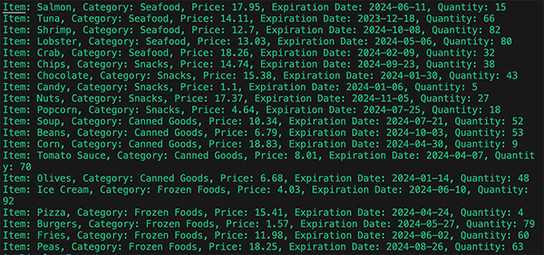
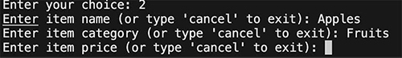
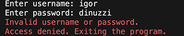

# Supermarket Inventory Management System


This Python script offers a comprehensive solution for managing supermarket inventory. Utilizing the `openpyxl` library for Excel operations and `colorama` for enhanced terminal output, this script enables users to perform a variety of inventory management tasks. Key features include adding, updating, deleting items, searching items by name or category, and providing low stock alerts and expiration date warnings.

## Features

### General
- **Display Inventory**: View the entire inventory with details like item name, category, price, expiration date, and quantity.


- **Inventory Summary**: Get a summary of the inventory, including total items and quantities.


- **Low Stock Alert**: Receive alerts for items with low stock.


- **Expiration Date Warning**: Get warnings for items nearing their expiration date.


### Interactive Features with 'Cancel' Option
In several functions, users have the flexibility to exit the process at any time by typing "cancel". This feature is available in:
- **Add Item**: Add new items to the inventory. Type 'cancel' at any input prompt to exit.


- **Update Item Details**: Modify existing item details. Type 'cancel' at any input prompt to exit.


- **Delete Item**: Remove items from the inventory. Includes a YES/NO confirmation prompt to prevent accidental deletions. Type 'cancel' to exit the prompt.


- **Search for an Item**: Look up items by name. Type 'cancel' to exit the search.


- **Search by Category**: Find items based on their category. Type 'cancel' to exit the search.


## Installation

1. Clone the repository:
   ```bash
   git clone [URL to your repository]
   ```
2. Install the required packages:
   ```bash
   pip install openpyxl colorama
   ```

## Usage

Run the script using Python:
```bash
python inventory_management.py
```

You will be prompted to authenticate before accessing the inventory management functionalities.

## Authentication

For trial purposes, you can log in using the username `user1` and the password `password1`. The script uses a simple authentication system with predefined usernames and passwords. Update the `authenticate_user` function to modify or extend the authentication logic.




## Validation


## Data Storage

The inventory data is stored in an Excel file (`inventory.xlsx`). Ensure this file exists in the same directory as the script, or modify the `file_name` variable in the script to point to the correct file location.

## Customization

You can customize the script by modifying the source code to better fit your specific inventory management needs.

## Contributions

Contributions to this project are welcome. Please open an issue or submit a pull request with your proposed changes.

## Credits

Developed by Igor Dinuzzi.
