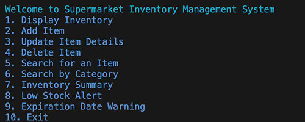
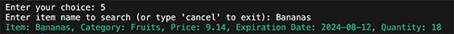
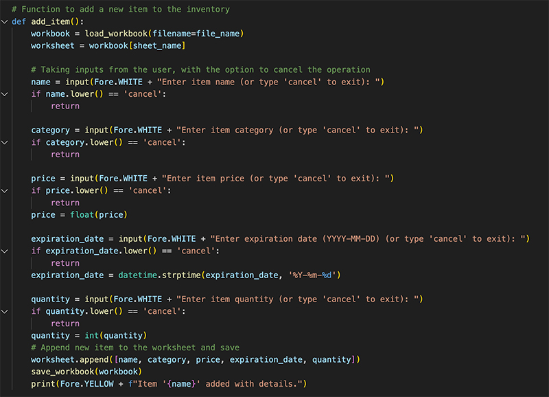
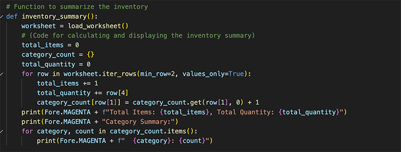
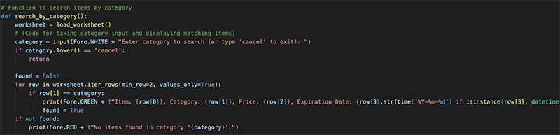
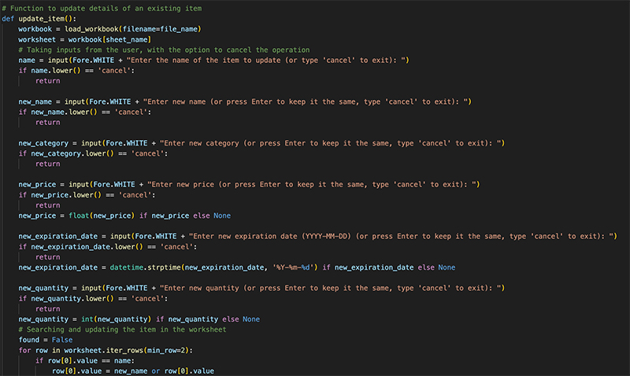
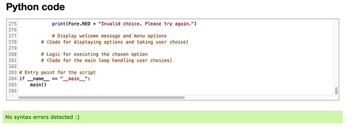

# Supermarket Inventory Management System



This Python script offers a comprehensive solution for managing supermarket inventory. Utilizing the `openpyxl` library for Excel operations and `colorama` for enhanced terminal output, this script enables users to perform a variety of inventory management tasks. Key features include adding, updating, deleting items, searching items by name or category, and providing low stock alerts and expiration date warnings.

## Features

### General
- **Display Inventory**: View the entire inventory with details like item name, category, price, expiration date, and quantity.


- **Inventory Summary**: Get a summary of the inventory, including total items and quantities.


- **Low Stock Alert**: Receive alerts for items with low stock.


- **Expiration Date Warning**: Get warnings for items nearing their expiration date.


### Interactive Features with 'Cancel' Option
In several functions, users have the flexibility to exit the process at any time by typing "cancel". This feature is available in:
- **Add Item**: Add new items to the inventory. Type 'cancel' at any input prompt to exit.


- **Update Item Details**: Modify existing item details. Type 'cancel' at any input prompt to exit.


- **Delete Item**: Remove items from the inventory. Includes a YES/NO confirmation prompt to prevent accidental deletions. Type 'cancel' to exit the prompt.


- **Search for an Item**: Look up items by name. Type 'cancel' to exit the search.


- **Search by Category**: Find items based on their category. Type 'cancel' to exit the search.


## Authentication

For trial purposes, you can log in using the username `user1` and the password `password1`. The script uses a simple authentication system with predefined usernames and passwords. Update the `authenticate_user` function to modify or extend the authentication logic.


You will be prompted to authenticate before accessing the inventory management functionalities.

## Data Storage

The inventory data is stored in an Excel file (`inventory.xlsx`). Ensure this file exists in the same directory as the script, or modify the `file_name` variable in the script to point to the correct file location.

## Customization

You can customize the script by modifying the source code to better fit your specific inventory management needs.

## Installation

1. Clone the repository:
   ```bash
   git clone [URL to your repository]
   ```
2. Install the required packages:
   ```bash
   pip install openpyxl colorama
   ```

## Usage

Run the script using Python:
```bash
python inventory_management.py
```

## Code snippets
### Add new item


### User login 


### Expiration date


### Delete item


### Inventory display screen


### Inventory summary view


### Main


### Search by category


### Search by item


### Low stock alert


### Update item


## User stories
- As a store manager, I want to view the entire inventory so that I can have a clear understanding of all items available in the store.

- As a store clerk, I want to add new items to the inventory system quickly, ensuring that all recent purchases are tracked and accounted for.

- As an inventory manager, I want to update item details in the inventory to ensure all information is current and accurate, including prices, categories, and quantities.

- As a store owner, I want to delete items from the inventory system that are no longer available or have been discontinued.

- As a store supervisor, I want to search for items by name to find specific products quickly and check their details like price, quantity, and expiration date.

- As a stock manager, I want to search inventory by category so that I can get a better overview of items grouped under a specific category.

- As a store manager, I need to view a summary of the inventory to get insights into the total number of items, total quantity, and category-wise distribution.

- As a store assistant, I want to receive alerts for items with low stock, ensuring timely restocking and preventing stockouts.

- As a quality control officer, I want to get warnings for items nearing their expiration date to manage inventory rotation and reduce waste.

- As a new employee, I want to access the system using my credentials to ensure security and track my inventory management activities.


## User Interaction Framework for the Supermarket Inventory Management System

Creating a task flow and a user flow for the Supermarket Inventory Management System will help visualize how users interact with the system and complete specific tasks. Here's a breakdown of both:

### Task Flow

1. **Start**: User logs into the system.
2. **Choose 'Add Item' Option**: User selects the option to add a new item from the main menu.
3. **Enter Item Details**: User is prompted to enter details such as item name, category, price, expiration date, and quantity.
   - If the user types 'cancel' at any point, the process ends and returns to the main menu.
4. **Confirm Addition**: The system validates the entered details and adds the item to the inventory.
5. **Success Message**: The system displays a confirmation message that the item has been added.
6. **Return to Main Menu** or **Add Another Item**: The user decides to return to the main menu or continue adding more items.

### User Flow

1. **Authenticate**: The manager starts by logging into the system using their credentials.
2. **Main Menu Overview**: Upon successful login, the manager views the main menu with options like 'Display Inventory', 'Add Item', 'Update Item', etc.
3. **Task Selection**: 
   - The manager selects a task to perform, such as 'Display Inventory' to review current stock levels.
   - They might choose 'Low Stock Alert' to view items that need restocking.
   - They could select 'Inventory Summary' for a quick overview of total items and quantities.
4. **Performing Tasks**: Depending on the selection, the manager engages with the respective feature (e.g., reviewing inventory, checking low stock items).
5. **Decision Making**: Based on the information gathered (like low stock), the manager makes decisions (e.g., ordering more stock).
6. **Further Actions**: The manager may then proceed to perform other tasks like updating item details, adding new items, or deleting old ones.
7. **Logging Out**: After completing the tasks, the manager logs out of the system.

## Validation



## Contributions

Contributions to this project are welcome. Please open an issue or submit a pull request with your proposed changes.

## Credits

Developed by Igor Dinuzzi.
